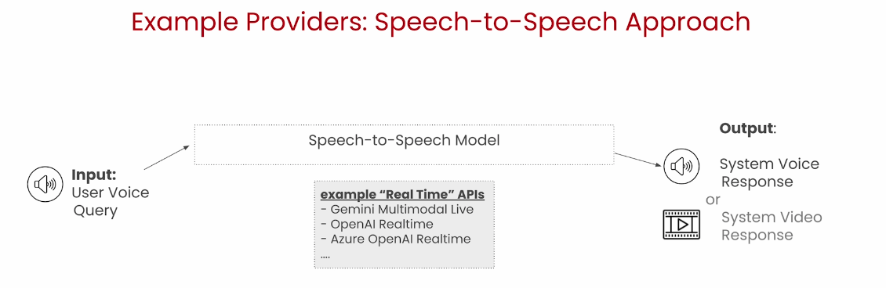
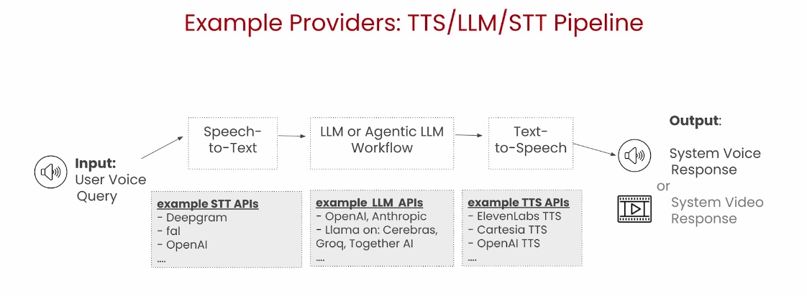
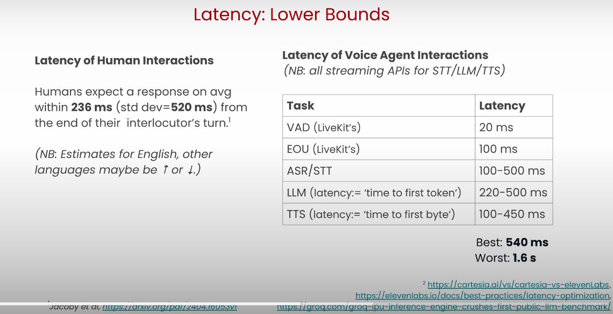

## What is a Voice Agent?
- Voice Agents combine speech and reasoning abilities of foundation models to deliver real-time, human-like voice interactions.

- 2 options:
  - Speech-to-Speech (aka `Real Time`) Model
    - simpler to implement, but low control and flexibility  
    

  - Pipeline
    - Speech-to-Text -> LLM or Agentic LLM Workflow -> Text-to-Speech  
    

  - Every system has tradeoffs, need to make a decision at some point between Latency, Quality, and cost.
  - The advantage of the a pipeline approach is that you can make different tradeoffs for different parts of the system based on what's most important

- Pipeline detail
  - Voice Activity Detection (VAD)
    - detect when user is speaking
    - VAD only sends audio when it notices that someone is speaking, this is very important, since it significantly decreases the amount of hallucinations that you will get from your STT model. It will also dramatically decrease your costs
  - End of Turn / Utterance Detection (EOU)
    - detecting whether a speaker has finished speaking

  - VAD and Turn Detection default behavior is blocking

  - Automatic Speech Recognition (ASR), Speech-to-Text (STT)
    - decide which language we support, if we want to do direct speech translations, and if we want to use a specialized model for specific speech cases like telephony.
  - LLMs and LLM Agent
  - Text-to-Speech (TTS) , Speech Synthesis
    - takes the text output from the LLM and turns it into speech. This is where you need to decide which voice and accent to use, and if you want to apply any pronunciation overrides.

<b>Live conversation requires low latency audio streaming</b>

- Latency Optimization
  - Non-trivial to estimate in practice
  - In Voice Agents using the STT + LLM + TTS architecture, the LLM is often the primary source of latency.
    - if self hosting, use smaller/quantized model.
    - shorten the reply or construct the reply in segments(interstitial or a short acknowledgement before the full reply is given)
