# Network

- IP, TCP, UDP, HTTP, WebSocket, WebRTC  

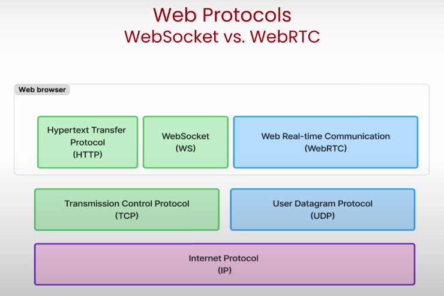

- TCP
  - if packet are lost, TCP will retransmit them, agent continue to wait
  - large amount of packets are sent and received at the same time, so even if little bit of packets are lost, it has to wait for the retransmit to complete

- UDP
  - if packet are lost, UDP will not retransmit them, agent will not wait for the retransmit to complete
  - less overhead, faster than TCP
  - not reliable, but good for live streaming

- HTTP
  - Built on TCP
  - Stateless - every request and response is a new connection and independent (except SSE)
  - Hypertext transfer protocol - it was designed for transferring text  
  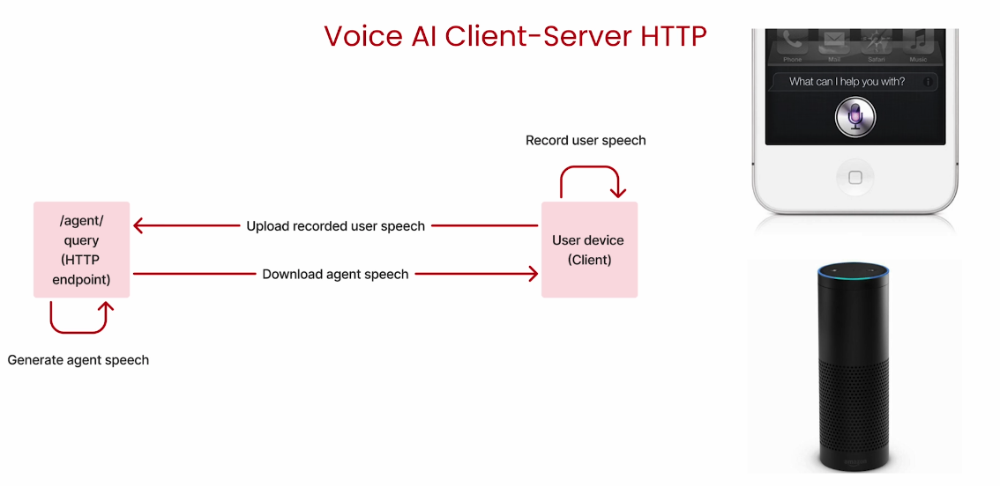

- WebSocket
  - Pros
    - supports full-duplex, persistent connections
    - easy to use
  - Cons
    - Built on TCP
    - No special facilities for streaming audio data

- WebRTC
  - An open-source project enabling real-time communication (RTC) capabilities directly in web browsers and mobile applications.
  - Allow audio, video, and data sharing without the need for plugins or external software.
  - Utilizes getUserMedia() API to access device cameras and microphones.
  - Enables screen sharing through getDisplayMedia()
  - Uses RTCDataChannel for peer-to-peer data exchange

  - Pros
    - Supports full-duplex, persistent connections
    - Built on UDP
    - Designed for streaming audio and video
        - Congestion control
        - Data compression(automatically applied before sending)
        - Automatic packet timestamps
  - Cons
    - Complexity  
    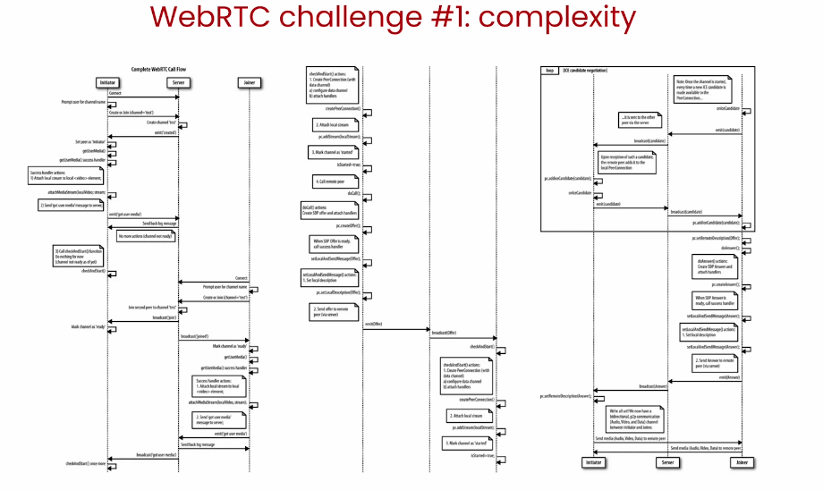
    - Scale (it's designed for peer to peer, not server to many clients)  
    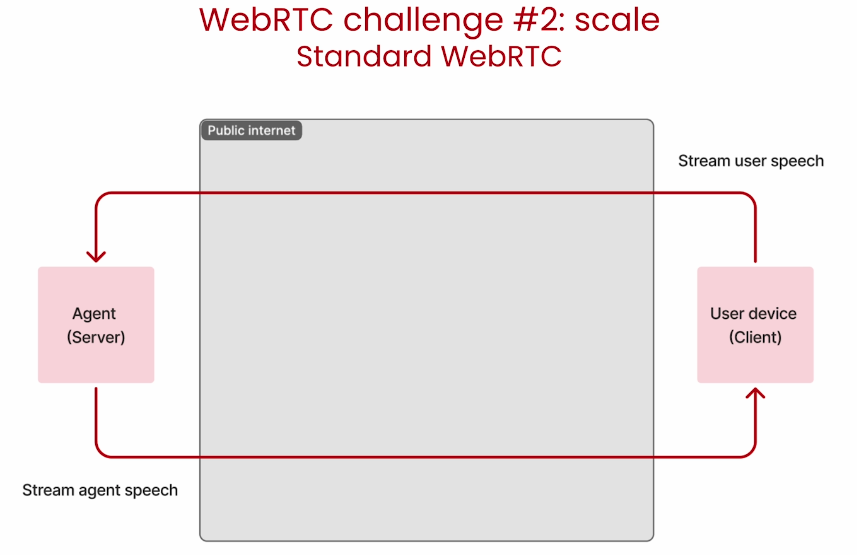
      - needed to deploy multiple servers to handle multiple clients

  - LiveKit Cloud offer private network for low latency and high throughput  
  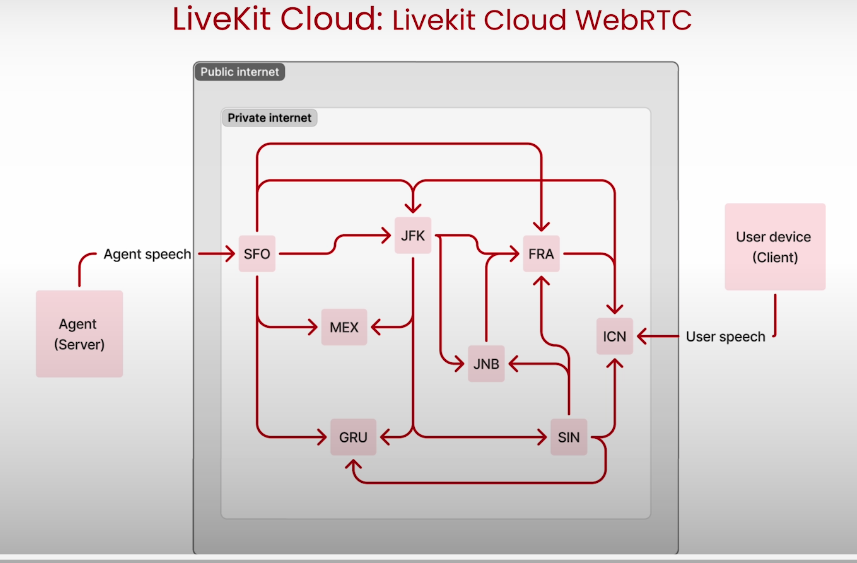

# Voice AI Agent Architecture

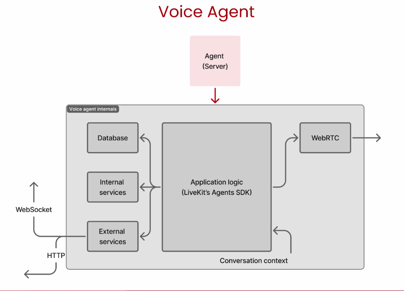

- Agent Turn Detection (TD)
  - heuristic way to detect when user is speaking and when agent can speak
  - VAD : is user actually speaking? by energy level of the audio
  - Semantic turn deteection : what user actually saying? by transcript of the audio  
  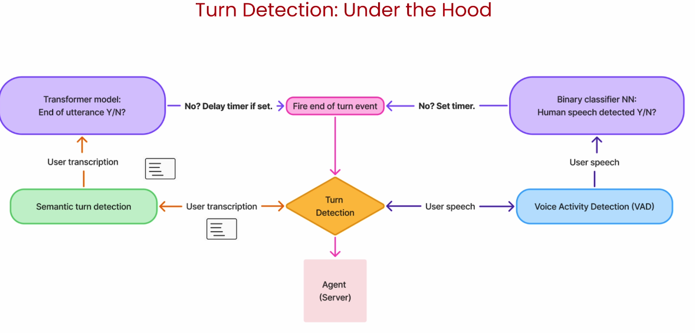

Not only for the turn detection for user speaking, but also for the turn detection for agent speaking  

whille agent is speaking and detect user is speaking and take it a interruption than all the inference at that time will be interrupted and flushed.  

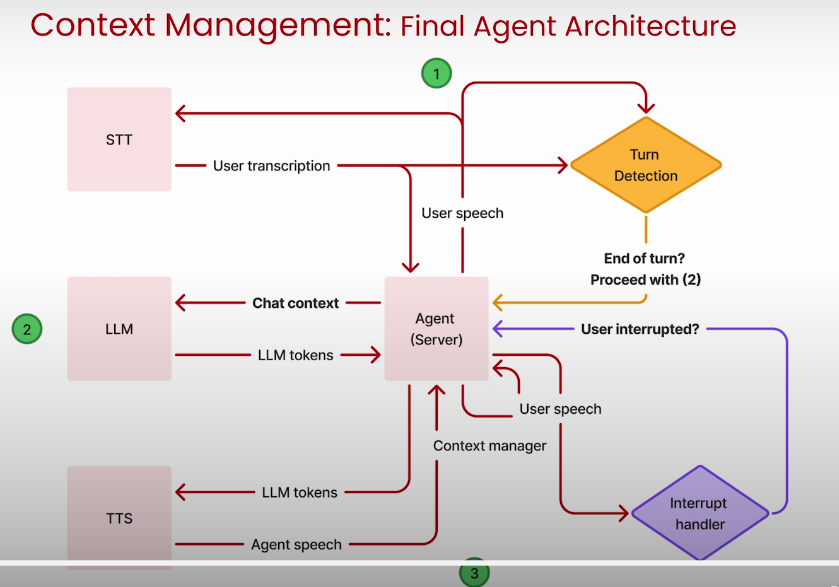

# Optimizing for Latency

- VAD, STT layer  
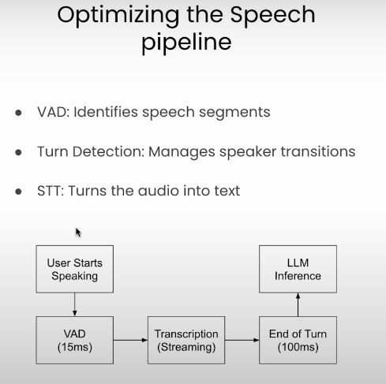

- LLM layer  
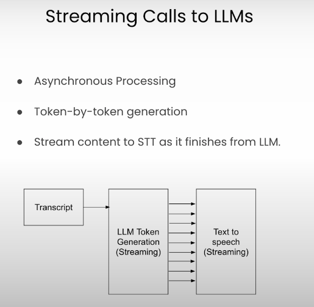

- TTS layer  
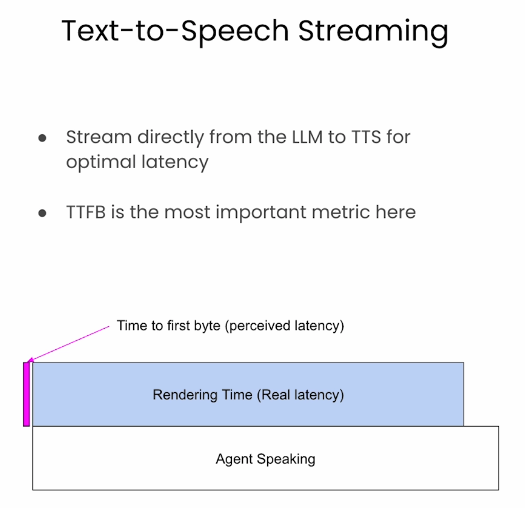

  