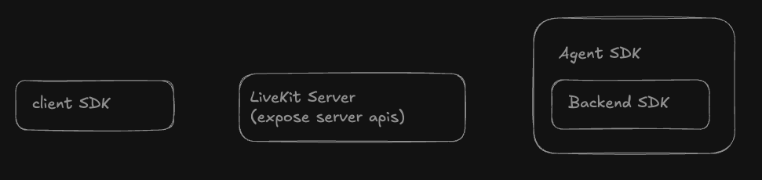
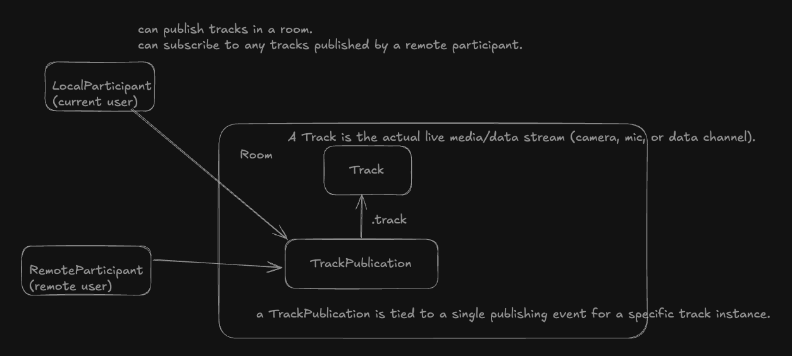
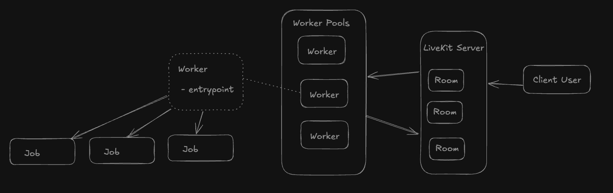

## LiveKit Core Components

- LiveKit Server (expose server API)
- Client SDK
- Backend SDK
  - Agent SDK

## Rooms, participants, tracks

- local participant vs remote participants
  - local and remote are always relative to the client SDK instance.
  - In the browser SDK, that’s the person (or process) who joined using room.connect(token, …).
  - `I am always the LocalParticipant. Everyone else is RemoteParticipants.`

In the user’s client SDK:
  - The user is LocalParticipant.
  - The agent appears as a RemoteParticipant.

In the agent process:
  - The agent is LocalParticipant.
  - The user appears as a RemoteParticipant.

## Worker Life Cycle

### Lifecycle
When a user connects to a room, a worker fulfills the request to dispatch an agent to the room. An overview of the worker lifecycle is as follows:

1. Worker registration: Your agent code registers itself as a "worker" with LiveKit server, then waits on standby for requests.
2. Job request: When a user connects to a room, LiveKit server sends a request to an available worker. A worker accepts and starts a new process to handle the job. This is also known as agent dispatch.
3. Job: The job initiated by your entrypoint function. This is the bulk of the code and logic you write. To learn more, see Job lifecycle.
4. LiveKit session close: By default, a room is automatically closed when the last non-agent participant leaves. Any remaining agents disconnect. You can also end the session manually.

When a worker accepts a job request from LiveKit server, it starts a new process and runs your agent code inside. Each job runs in a separate process to isolate agents from each other. If a session instance crashes, it doesn't affect other agents running on the same worker. The job runs until all standard and SIP participants leave the room, or you explicitly shut it down.

