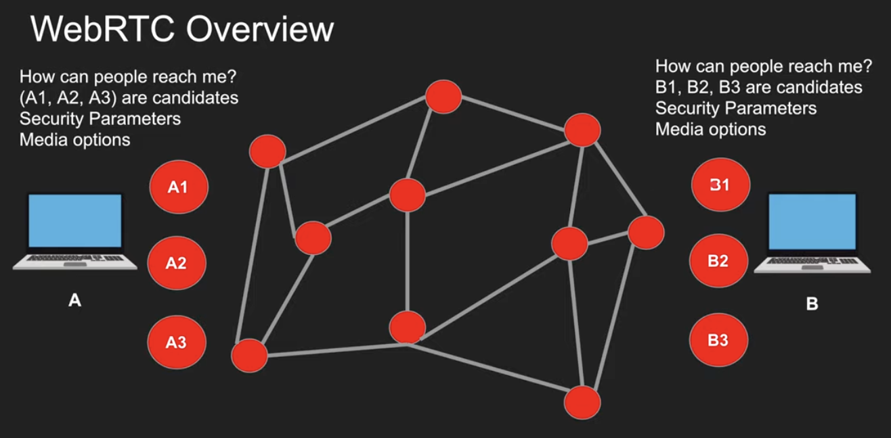
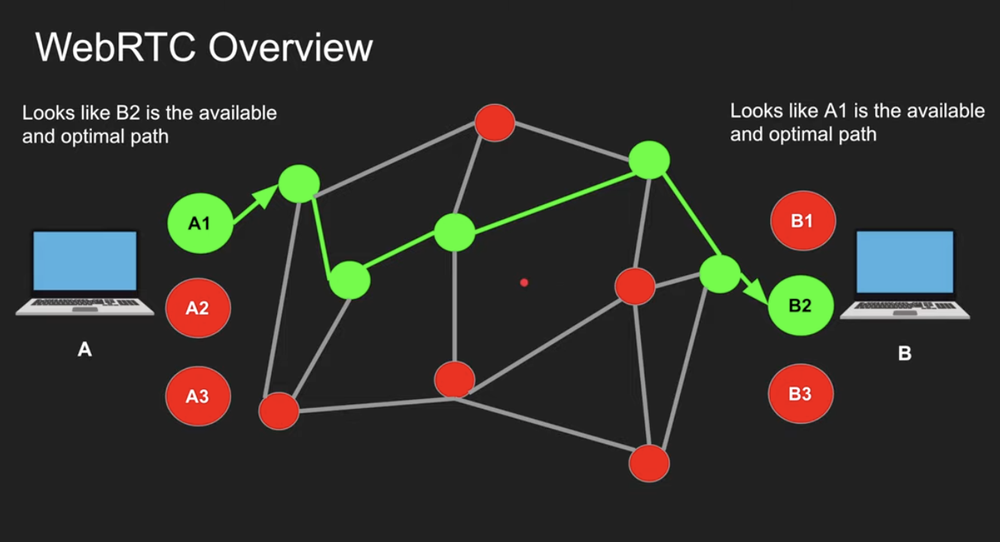
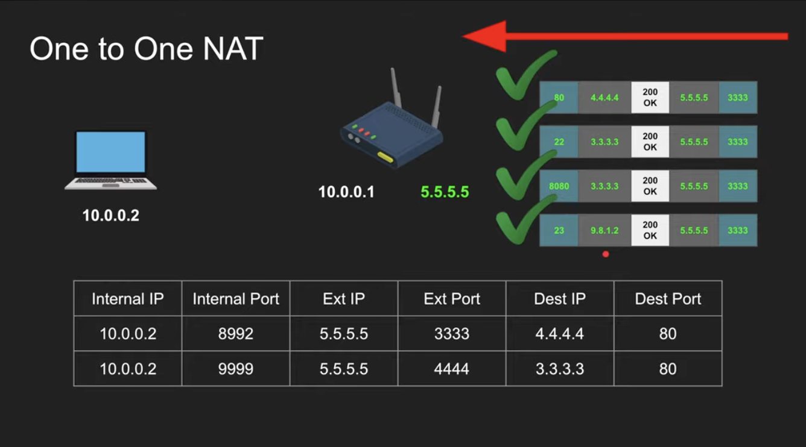
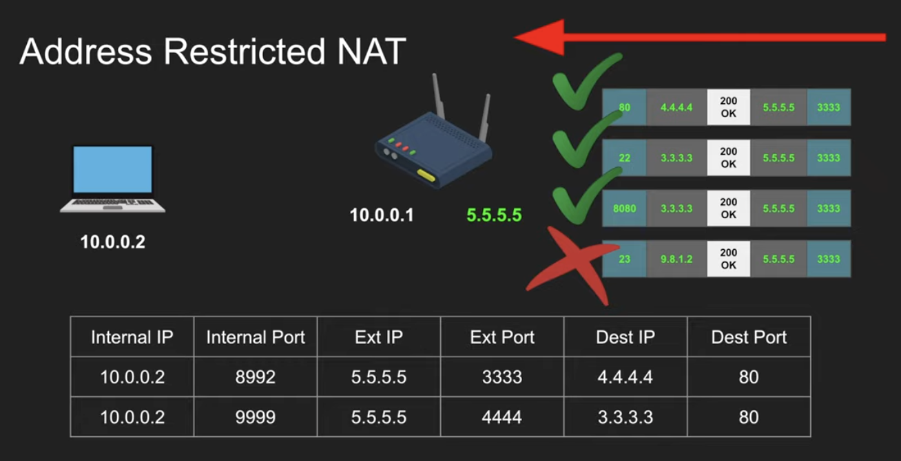
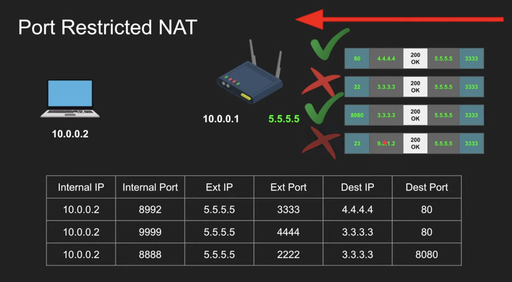
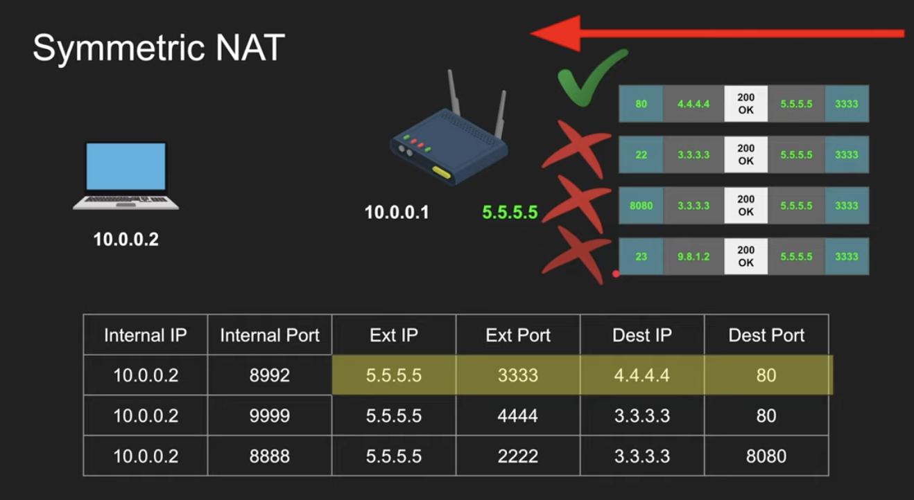
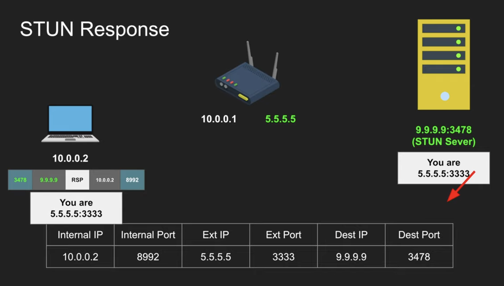
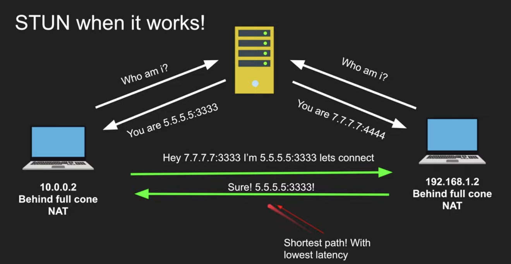
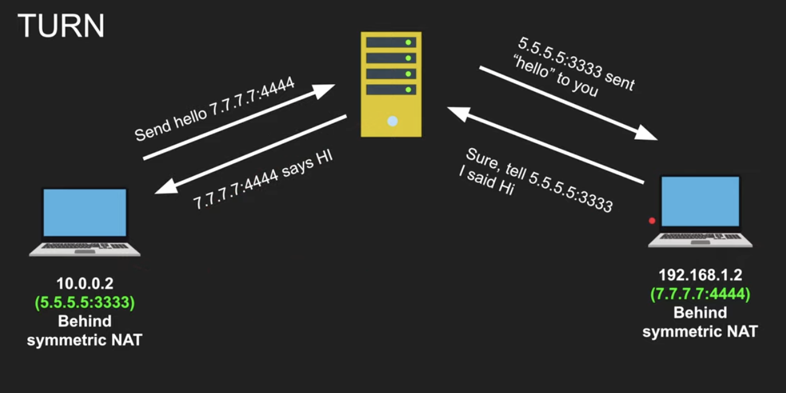

## WebRTC Overview

- Stands for Web Real-Time Communication
- Find a peer-to-peer path to exchange video and audio in an efficient and low latency manner
- Standardized API
- Enables rich communication for browsers, mobile, IOT devices

### What happens in a WebRTC call?

- A wants to connect to B
- A finds out all possible ways the public can connect to it
  - who can connect to A?
- B finds out all possible ways the public can connect to it
  - who can connect to B
- A and B signal this session information via other means
  - WhatsApp, QR, Tweet, WebSockets, HTTP Fetch ...
- A connects to B via the most optimal path
- A & B also exchange their supported media and security

### WebRTC Demystified

### NAT (Network Address Translation)
- Router = The physical device that connects your home network to the internet
- NAT = A specific job/function that the router does (address translation)

- if you are behind the Router (don't have public IP address)

- 4 types of NATs:
  - One to One NAT (Full-cone NAT)
    - packets to external IP:port on the router always maps to internal IP:port without exception  
    
  - Address restricted NAT
    - packets to external IP:port on the router always maps to internal IP:port as long as source address from packet matches the table (regardless of source port)  
    
  - Port restricted NAT
    - packets to external IP:port on the router always maps to internal IP:port as long as source address and port from packet matches the table
    - allow if we communicated with this host:port before  
    
  - Symmetric NAT
    - not fit for WebRTC
    - Packets to external IP:port on the router always maps to internal IP:port as long as source address and port from packet matches the table
    - Only allow if the full pair match  
    

### STUN (Session Traversal Utilities for NAT)
- Tell me my public IP address/port through NAT
- Works for Full-cone, Port/Address restricted NAT
- Doesn't work for Symmetric NAT
- STUN server port 3478, 5349 for TLS
- Cheap to maintain  

### TURN (Traversal Using Relays around NAT)
- In case of Symmetric NAT we use TURN
- It's just a server that relays packets
- TURN default server port 3478, 5349 for TLS
- Expensive to maintain and run  

### ICE (Interactive Connectivity Establishment)
- ICE collects all available candidates (local IP addresses (what if we are in the same network?), reflexive addresses - STUN ones, relayed addresses - TURN ones)
- Called ICE candidates
- All the collected addresses are then sent to the remote peer via SDP

### SDP (Session Description Protocol)
- A format that describes ICE candidates, networking options, media options, security options and other stuff
- Not really a protocol it's a format
- Most important concept in WebRTC
- The goal is to take the SDP generated by a user and send it 'somehow' to the other party

### Signaling the SDP
- Send the SDP that we just generated somehow to the other party we wish to communicate with
- Signaling can be done via a tweet, QR code, Whatsapp, WebSockets, HTTP Fetch ... just get that large string to the other party

1. A wants to connect to B
2. A creates an 'offer', it finds all ICE candidates, security options, audio/video options and generates SDP, the offer is basically the SDP
3. A signals the offer somehow to B
4. B creates the 'answer (it's SDP)' after setting A's offer
5. B signals the 'answer (it's SDP)' to A
6. Connection is created